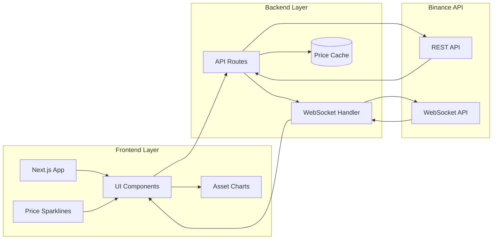

# Binance Real-Time Trading Dashboard

A modern, production-ready Binance spot market dashboard with:
- All spot pairs and coins
- Real-time prices and 24h stats
- Coins tab with live price, change, and sparklines
- Virtualized table for fast browsing
- Favorites, advanced filters, and sorting
- Binance-style dark mode

---

## 🚀 Features
- **All Binance Spot Pairs**: Instantly see all trading pairs and filter/search with ease.
- **Coins Tab**: Browse all tokens/coins, see their live price (from the most liquid pair), 24h change, and a mini sparkline chart.
- **Real-Time Data**: Prices and stats update live via Binance WebSocket.
- **Favorites**: Star your favorite pairs for quick access.
- **Advanced Filters**: Filter by quote asset (e.g. USDT), show only favorites, and sort by price/change.
- **Dark Mode**: Toggle between light and Binance-style dark mode.

---

## 🛠️ Getting Started

### Prerequisites
- Node.js (v18+ recommended)
- npm (v9+ recommended)

### Installation
```bash
npm install
```

### Running Locally
```bash
npm run dev
```
Then open [http://localhost:3000](http://localhost:3000) in your browser.

---

## 🧪 How to Test the Dashboard

1. **Browse All Pairs:**
   - Use the "Pairs" tab to see all Binance spot pairs, search/filter, and sort.
2. **Explore Coins:**
   - Switch to the "Coins" tab to see all coins/tokens, each with live price, 24h change, and a sparkline.
   - Click any coin to see all its tradable pairs and stats.
3. **Favorites:**
   - Star your favorite pairs in the pairs table. Toggle "Show Favorites" to filter.
4. **Filters and Sorting:**
   - Filter by quote asset (e.g. USDT), sort by symbol, price, or 24h change.
5. **Dark Mode:**
   - Use the toggle in the top right to switch between light and dark themes.
6. **Live Updates:**
   - All prices and stats update in real time—no need to refresh!

---

## 📦 Production Build
```bash
npm run build
npm run start
```

---

## 🐳 Docker Deployment

### Build the Docker Image
```bash
docker build -t binance-dashboard .
```

### Run the Container
```bash
docker run -d -p 3000:3000 --name binance-dashboard binance-dashboard
```

The dashboard will be available at [http://localhost:3000](http://localhost:3000)

### Docker Commands Reference
- **Stop the container:**
  ```bash
  docker stop binance-dashboard
  ```
- **Start an existing container:**
  ```bash
  docker start binance-dashboard
  ```
- **Remove the container:**
  ```bash
  docker rm binance-dashboard
  ```
- **View logs:**
  ```bash
  docker logs -f binance-dashboard
  ```

---

## Folder Structure
- `pages/` - Next.js pages (frontend & API routes)
- `components/` - React components
- `lib/` - Utility code (e.g., API clients)

---

## 🔗 Binance API Integration

This project integrates with the official Binance API to provide real-time and historical trading data. Below is an overview of how API calls are made and where to find or add them in the codebase:

### REST API Calls
- **Fetching all spot pairs:**
  - File: `components/AssetDashboard.tsx`
  - Example: 
    ```js
    await axios.get('https://api.binance.com/api/v3/exchangeInfo');
    ```
- **Fetching 24hr ticker data:**
  - File: `components/AssetDashboard.tsx`
  - Example:
    ```js
    await axios.get('https://api.binance.com/api/v3/ticker/24hr');
    ```
- **Fetching historical candlestick data:**
  - File: `components/CandlestickChart.tsx`
  - Example:
    ```js
    await axios.get(`https://api.binance.com/api/v3/klines?symbol=${symbol}&interval=${interval}&limit=${limit}`);
    ```
- **Backend API routes:**
  - Files: `pages/api/prices.ts`, `pages/api/history.ts`
  - These files proxy requests to Binance for current prices and historical data.

### WebSocket API Calls (Real-Time Data)
- **Real-time mini ticker updates:**
  - File: `components/AssetDashboard.tsx`
  - Example:
    ```js
    new window.WebSocket('wss://stream.binance.com:9443/ws/!miniTicker@arr');
    ```
- **Real-time candlestick (kline) updates:**
  - File: `components/CandlestickChart.tsx`
  - Example:
    ```js
    new window.WebSocket(`wss://stream.binance.com:9443/ws/${symbol.toLowerCase()}@kline_1h`);
    ```

### Where to Add New API Calls
- **Frontend (React components):**
  - Add calls directly in components inside the `components/` directory for UI-driven data fetching or WebSocket subscriptions.
- **Backend (API routes):**
  - Add new endpoints in `pages/api/` to proxy or aggregate data from Binance, especially if you want to keep your API keys or logic server-side.

For more details, see:
- [Binance REST API docs](https://binance-docs.github.io/apidocs/spot/en/)
- [Binance WebSocket Streams](https://binance-docs.github.io/apidocs/spot/en/#websocket-market-streams)

---

## 🏗️ System Architecture



### Architecture Overview
- **Frontend Layer**: Next.js app with React components for real-time price displays and charts
- **Backend Layer**: API routes for data fetching and WebSocket handler for live updates
- **Data Flow**: 
  - REST API calls for initial data and historical prices
  - WebSocket connections for real-time price updates
  - In-memory cache for optimal performance

## ⚙️ Configuration Options

### Environment Variables
```env
# Required
BINANCE_API_KEY=your_api_key
BINANCE_API_SECRET=your_api_secret

# Optional
PRICE_UPDATE_INTERVAL=1000  # Default: 1000ms
WEBSOCKET_RECONNECT_DELAY=3000  # Default: 3000ms
CACHE_DURATION=60  # Default: 60 seconds
MAX_PAIRS_PER_REQUEST=100  # Default: 100
```

### WebSocket Configuration
```typescript
const wsConfig = {
  reconnectAttempts: 5,
  reconnectDelay: 3000,
  pingInterval: 30000,
  pongTimeout: 1000
};
```

### Chart Configuration
```typescript
const chartConfig = {
  theme: 'dark',  // 'dark' | 'light'
  candlestickColors: {
    up: '#26a69a',
    down: '#ef5350',
    unchanged: '#b6b6b6'
  },
  intervals: ['1m', '5m', '15m', '1h', '4h', '1d']
};
```

## 🔧 Advanced Configuration

### Cache Settings
The dashboard uses in-memory caching for optimal performance. Configure cache behavior in `lib/utils.ts`:

```typescript
const CACHE_CONFIG = {
  prices: {
    ttl: 60,  // Time-to-live in seconds
    checkPeriod: 120  // Cleanup interval
  },
  pairs: {
    ttl: 3600,  // 1 hour
    checkPeriod: 7200
  }
};
```

### Rate Limiting
Built-in rate limiting follows Binance API restrictions:
- REST API: 1200 requests per minute
- WebSocket: 5 connections per IP
- Order rate: 50 orders per 10 seconds

## 🚀 Performance Optimization

### Browser Performance
1. **Memory Management**
   - Unsubscribe from unused WebSocket streams
   - Cleanup chart instances when switching pairs
   - Use virtualized lists for large datasets

2. **Network Optimization**
   - Batch API requests where possible
   - Use compression for API responses
   - Implement proper WebSocket reconnection strategy

3. **Rendering Performance**
   - Implement proper React memo and useMemo
   - Use Web Workers for heavy calculations
   - Optimize chart redraws

### Server Performance
1. **Caching Strategy**
   - In-memory cache for frequent data
   - Implement stale-while-revalidate pattern
   - Use proper cache invalidation

2. **WebSocket Management**
   - Implement connection pooling
   - Handle reconnections gracefully
   - Monitor connection health

## 🔍 Troubleshooting

### Common Issues

1. **WebSocket Connection Issues**
   ```
   Error: WebSocket connection failed
   ```
   - Check network connectivity
   - Verify WebSocket endpoint is accessible
   - Ensure proper API key permissions

2. **Rate Limit Exceeded**
   ```
   Error: APIError: Too many requests
   ```
   - Implement proper request throttling
   - Use bulk endpoints where possible
   - Check your API key rate limits

3. **Chart Rendering Issues**
   - Clear browser cache
   - Update chart library version
   - Check console for JavaScript errors

### Debugging Tools

1. **Network Monitoring**
   - Use browser DevTools Network tab
   - Monitor WebSocket frames
   - Check API response times

2. **Performance Profiling**
   - React DevTools Profiler
   - Chrome Performance tab
   - Memory usage monitoring

3. **Error Tracking**
   - Check browser console
   - Monitor server logs
   - Use error boundary components

## 📦 Production Deployment Tips

### Checklist
1. Set proper environment variables
2. Enable error monitoring
3. Configure proper CORS headers
4. Set up SSL certificates
5. Configure proper WebSocket timeouts
6. Enable gzip compression
7. Set up health check endpoints
8. Configure proper logging

### Monitoring
- Track WebSocket connection status
- Monitor memory usage
- Track API response times
- Set up error alerting
- Monitor cache hit rates

### Security
- Use proper CORS configuration
- Implement rate limiting
- Secure WebSocket connections
- Validate API inputs
- Use proper error handling

## 🤝 Contributing

Please read [CONTRIBUTING.md](CONTRIBUTING.md) for details on our code of conduct and the process for submitting pull requests.

### Development Workflow
1. Fork the repository
2. Create your feature branch
3. Run tests and linting
4. Submit a pull request

### Code Style
- Follow TypeScript best practices
- Use proper ESLint configuration
- Follow React hooks guidelines
- Write meaningful comments
- Include proper type definitions

## 📝 License
MIT
